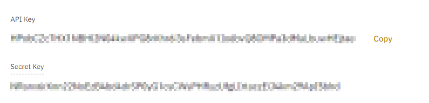

## Home Assistant sensor component for Binance Spot Wallet
[](https://github.com/custom-components/hacs)
#### Powered by Binance API

### Features
- Total wallet value in BTC as sensor value
- Wallet assets as sensor attributes

#### Attributes
- `assets[]`: List of assets in wallet
  - `asset`: Asset symbol, e.g. "BTC"
  - `total`: Total amount (free + locked)
- `data_timestamp`: Timestamp associated with this wallet snapshot

### Configuration
- First, create an API-Application in your [Binance account management](https://www.binance.com/de/my/settings/api-management).
- (Optional) Restrict API-access to `Enable Reading` only if you like
- Copy the **API Key** and **Secret Key**:

- Use your `secrets.yaml` to store the keys (see [this guide](https://www.home-assistant.io/docs/configuration/secrets/)).
  You can also paste the keys as plain-text in the `configuration.yaml` though this is not recommended.
- Create a sensor entry in your `configuration.yaml` like this:
```Configuration.yaml:
  sensor:
    - platform: binancewallet
      api_key: "S7LLxxxx..."           (required)
      api_secret: "hQYJxxxx..."        (required)
      name: "main wallet"              (optional, default = <first 4 characters of API key>) 
      icon: "mdi:currency-btc"         (optional, default = "mdi:bitcoin")
```

### Caveats
- Binance API only provides **daily** snapshots. Therefore, this sensor will only update once a day.